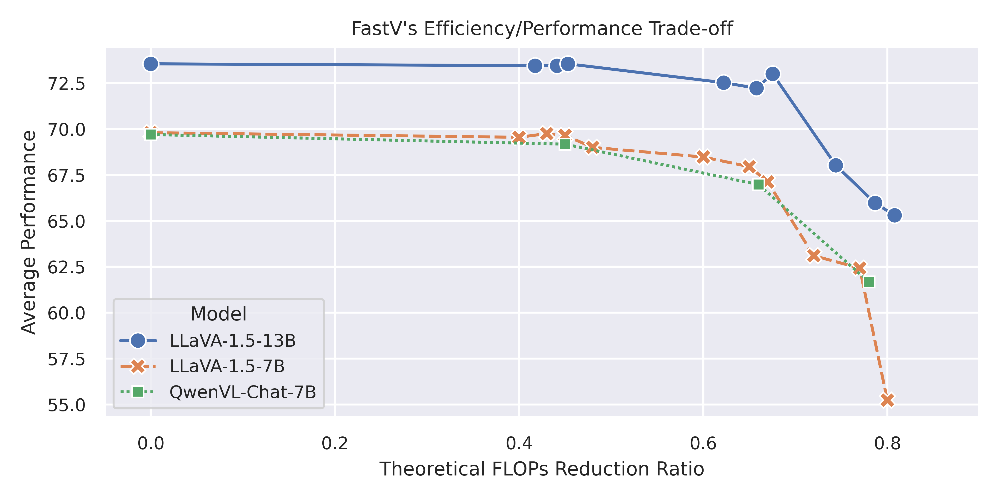
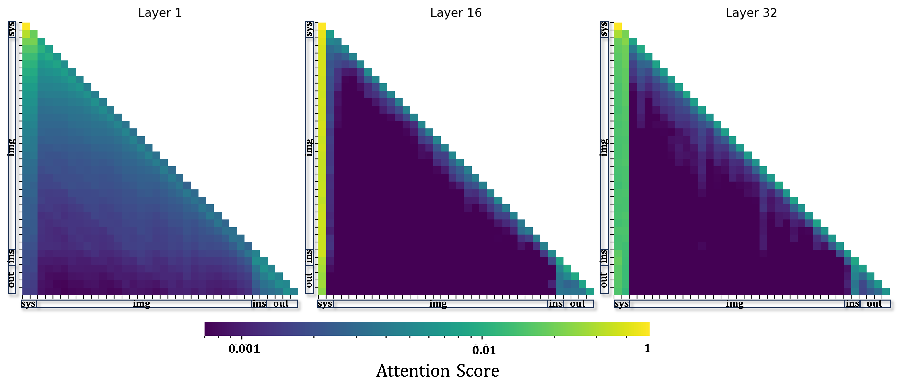
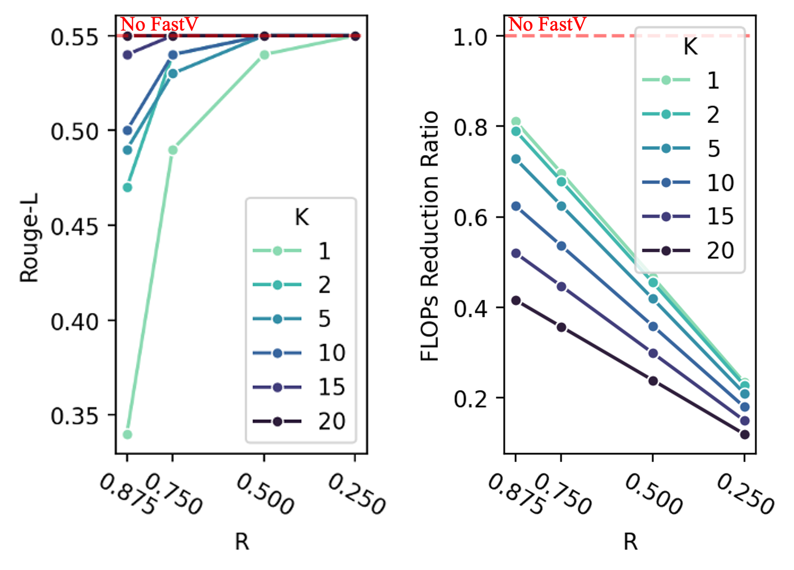

<h1 align="center">FastV</h1>

<p align="center">
<a href="https://arxiv.org/abs/2403.06764">
</a>

<a href="https://www.youtube.com/watch?v=V0I6ntvb9pQ">
</a>


*2024.07.01: FastV is accepted to ECCV 2024!*

*FastV is a plug-and-play inference acceleration method for large vision language models relying on visual tokens. It could reach 45\% theoretical FLOPs reduction without harming the performance through pruning redundant visual tokens in deep layers.*


<div align=center>

Tutorial video on youtube. Thanks to [
Soroush Mehraban](https://www.youtube.com/@soroushmehraban)!

[](https://www.youtube.com/watch?v=V0I6ntvb9pQ)
    
https://github.com/pkunlp-icler/FastV/assets/43977888/e6ae44b9-ebb9-4b69-b534-cee3441b1d22



</div>

---
*Scheduled Updates🔥*

0. - [x] Setup
1. - [x] Visualization [Online Demo](https://www.fastv.work/)
2. - [x] LVLM Inefficent Visual Attention Visualization Code
3. - [x] FastV Inference and Evaluation
4. - [x] Latency Test Reproduction Guideline
5. - [x] Support HuggingFace Models (LLaVA)
6. - [x] Support KV Cache
7. - [x] Support lmms-eval and report results

Stay tuned!

## Setup
```bash
conda create -n fastv python=3.10
conda activate fastv
cd src
bash setup.sh
```


## Online Demo

We provide an [online demo](https://www.fastv.work/) for the FastV model. You can upload an image, enter a prompt, and select the number of layers to get the generated response and visualize the attention maps.

If you want to start your own demo, run the following script:
```bash
python demo.py --model-path ./llava-v1.5-7b
```

## Visualization: Inefficient Attention over Visual Tokens 

we provide a script (./src/FastV/inference/visualization.sh) to reproduce the visualization result of each LLaVA model layer for a given image and prompt.

```bash
bash ./src/FastV/inference/visualization.sh
```
or
```bash
python ./src/FastV/inference/plot_inefficient_attention.py \
    --model-path "PATH-to-HF-LLaVA1.5-Checkpoints" \
    --image-path "./src/LLaVA/images/llava_logo.png" \
    --prompt "Describe the image in details."\
    --output-path "./output_example"\
```

Model output and attention maps for different layers would be stored at "./output_example"

<div align=center>

</div>

## FastV Inference and Evaluation

We provide code to reproduce the ablation study on K and R values, as shown in figure-7 in the paper. This implementation masks out the discarded tokens (no speed up) in deep layers for convenience and fair performance comparison.

*ocrvqa*
```bash
bash ./src/FastV/inference/eval/eval_ocrvqa_fastv_token_mask.sh
```

<div align=center>
<br>
Results 
</div>


### Latency Experiment Reproduction
You could use following code to reproduce FastV's latency experiment on aokvqa. We conduct the following experiments on one A100 GPU (80G) 

```bash
bash ./src/FastV/inference/eval/eval_aokvqa_latency_fastv_inplace.sh
```

*aokvqa results*
| Model                         | Score | latency / first output token (A100 80G) | GPU Memory |
| ----------------------------- | ----- | --------------------------------------- | ---------- |
| 7B Vanilla Decoding           | 76.8  | 0.138s                                  | 18G        |
| 13B Vanilla Decoding          | 81.9  | 0.203s                                  | 33G        |
| \- 13B FastV (K=2 R=25%)      | 81.8  | 0.181s                                  | 29G        |
| \- 13B FastV (K=2 R=50%)      | 81.3  | 0.155s                                  | 28G        |
| \- 13B FastV (K=2 R=75%)      | 80.9  | **0.124s**                                  | 27G        |
| 13B Vanilla Decoding 4Bit     | 81.5  | 0.308s                                  | 12G        |
| \- 13B FastV 4Bit (K=2 R=25%) | 81.7  | 0.277s                                  | 11G        |
| \- 13B FastV 4Bit (K=2 R=50%) | 81.1  | 0.275s                                  | 10G        |
| \- 13B FastV 4Bit (K=2 R=75%) | 80.3  | 0.245s                                  | **9G**         |

This code implements the latency test of FastV using inplace token dropping instead of token masking (support K>0). FastV is also compatible with model quantization, just set the 4bit/8bit flag to be true from [inference_aokvqa.py](https://github.com/pkunlp-icler/FastV/blob/main/src/FastV/inference/eval/inference_aokvqa.py#L192) to see the performance.

The main implementation of FastV is in the forward function of LlamaModel from [modeling_llama.py](https://github.com/pkunlp-icler/FastV/blob/main/src/transformers/src/transformers/models/llama/modeling_llama.py#L730) of transformers repo.


## Integrate FastV to LLM inference framework


### Support HuggingFace LLaVA model

To use FastV with HF's model (currently support LLaVA), you need to install the latest transformer with fastv updated. (Note that [HF's LLaVA](https://huggingface.co/llava-hf/llava-1.5-13b-hf) is different from [original LLaVA implementation](https://github.com/haotian-liu/LLaVA))

```bash
conda create -n fastv-hf python=3.10
conda activate fastv-hf
cd ./src/FastV/llava-hf/transformers
pip install -e .
pip install pillow torch accelerate
```


You could simply pass a `fastv_config` dict to the `LlavaForConditionalGeneration` class to enable FastV decoding acceleration. We provide a python demo in `./demo-hf.py`.

```python
import requests
from PIL import Image
import time

import torch
from transformers import AutoProcessor, LlavaForConditionalGeneration, TextStreamer

model_id = "llava-hf/llava-1.5-13b-hf"

prompt = "USER: <image>\nWhat are these? Describe the image in details\nASSISTANT:"
image_file = "http://images.cocodataset.org/val2017/000000039769.jpg"

fastv_config = {
    "use_fastv": True,
    "fastv_k": 3,
    "fastv_r": 0.75,
    "image_token_start_index": 5, 
    "image_token_length": 576 
}

model = LlavaForConditionalGeneration.from_pretrained(
    model_id, 
    torch_dtype=torch.float16, 
    low_cpu_mem_usage=True, 
    attn_implementation="eager",
    fastv_config = fastv_config, # comment this line to use vanilla decoding
).to(0)

processor = AutoProcessor.from_pretrained(model_id)

raw_image = Image.open(requests.get(image_file, stream=True).raw)
inputs = processor(prompt, raw_image, return_tensors='pt').to(0, torch.float16)

output = model.generate(**inputs,min_new_tokens=300, max_new_tokens=500,do_sample=False, use_cache=False, return_dict_in_generate=True)

```

### Support KV Cache

Now, by setting use_cache=True in the generate function of ./demo-hf.py, you can activate fastv with the added efficiency of static kv-cache pruning. It's important to note that this implementation diverges slightly from the original version of fastv. In our approach, once pruning occurs in the initial forward process, all subsequent decoding tokens uniformly attend to the same set of image tokens. This contrasts with the original fastv method, where image tokens were subject to re-pruning during each forward pass. See this (disscusion)[https://github.com/pkunlp-icler/FastV/issues/14#issuecomment-2208160255] for more details.

Our findings indicate that enabling kv-cache in fastv results in a consistent reduction in CUDA memory usage, alongside a modest decrease in latency (approximately 8%). This efficiency gain is primarily limited by the current short length of image tokens in tasks involving single image understanding. However, in contexts requiring video understanding, which involves around ten times image tokens, the latency reduction achieved by fastv (with K=2 and R=50%) can reach up to 25% without hurting the performance.

### Support LMMs-Eval

[LMMs-Eval](https://github.com/EvolvingLMMs-Lab/lmms-eval) is an easy-to-use evaluation framework for lmms including various lmm benchmarks. You could follow `./src/FastV/lmms-eval/README.md` to update LLaVA with fastv to test the performance of fastv using lmms-eval. Some evaluation results with lmms-eval are listed below:

| LLaVA-1.5-7B   | Baseline (FLOPS=100%) | FastV K=3 R=50% (FLOPS=57%) |
|:--------------:|:--------:|:---------------:|
| Nocaps (CIDEr) | 105.5    | 105.5           |
| cococap_val_2014 (CIDEr) | 108.7   | 108.4         |
| cococap_val_2017 (CIDEr) | 110.4   | 110.8          |
| Flickr30K (CIDEr) | 74.9  | 74.7          |
| GQA (Acc) | 62.0   | 60.4          |
| SEED-Bench (Image-acc)    | 60.5     | 59.9            |
| MMMU (Acc)     | 35.3     | 35.2            |
| MME-Cognition  | 348.2    | 349.3           |
| MME-Perception | 1510.8   | 1511.7          |


## Acknowledgements

Thanks to [Zhihang Lin](https://github.com/Stardust1956) from Xiamen University for his contribution in the kv-cache and lmms-eval part.


## Citation
```bib
@misc{chen2024image,
      title={An Image is Worth 1/2 Tokens After Layer 2: Plug-and-Play Inference Acceleration for Large Vision-Language Models}, 
      author={Liang Chen and Haozhe Zhao and Tianyu Liu and Shuai Bai and Junyang Lin and Chang Zhou and Baobao Chang},
      year={2024},
      eprint={2403.06764},
      archivePrefix={arXiv},
      primaryClass={cs.CV}
}
```
